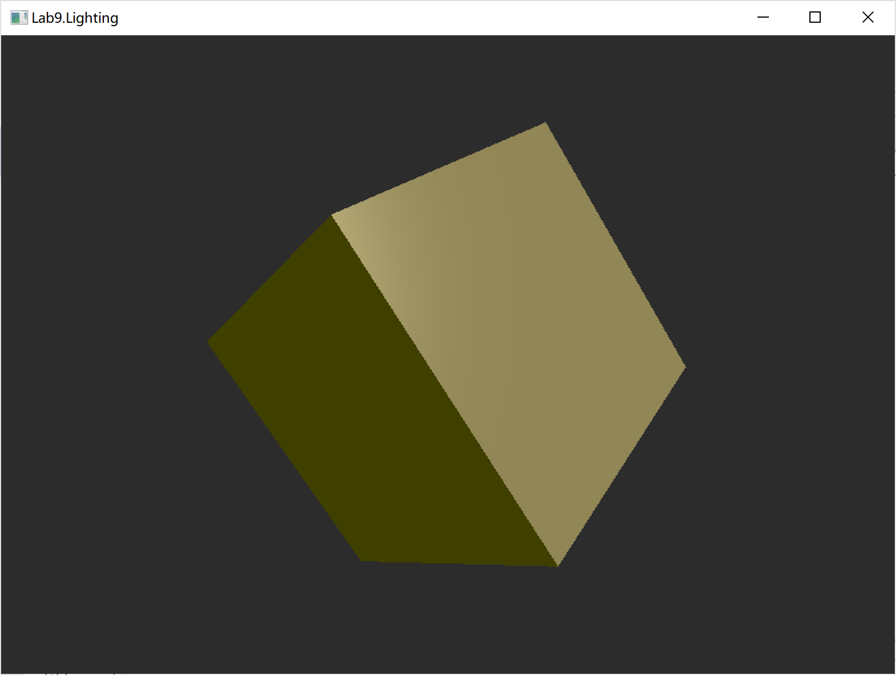
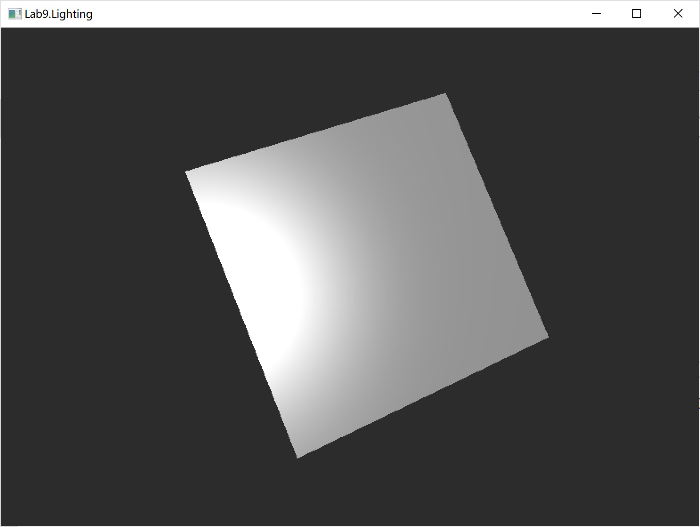
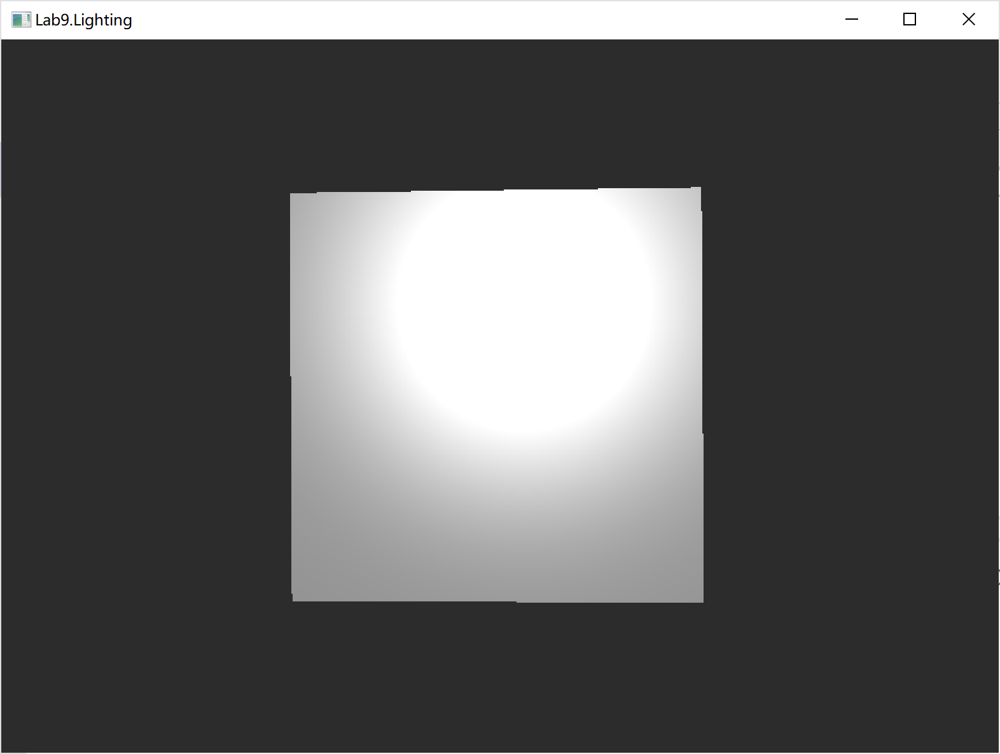

# 华东师范大学计算机科学与技术实验报告

| 实验课程：计算机图形学 | 年级：2018        | 实验成绩：               |
| ---------------------- | ----------------- | ------------------------ |
| 实验名称：Phong光照    | 姓名：李泽浩      | 实验日期：2021/5/11      |
| 实验编号：10           | 学号：10185102142 | 实验时间：pm.13:00-14:40 |
| 指导教师：李洋         | 组号：            |                          |

## 一、实验目的

利用HLSL实现基本Phong光照。

## 二、实验环境

Windows 10 + visual studio 2019 + D3D 11

## 三、实验内容

◦阅读代码

◦在shader中实现**平行光源**下的phong光照

◦在shader中实现**点光源**下的phong光照

## 四、实验原理

1. ##### 概述

Phong光照模型由Lambert光照模型发展而来。Lambert描述了物体表面对漫反射的反应。Phong光照模型在此基础上增加了环境光和镜面反射两项内容。

Phong光照模型和Lambert光照模型一样，依然是个经验模型。这是说，Phong光照模型只是依据粗糙的实验数据得出的一个近似物理世界的物理模型，并没有严格地按照物理定律进行推论和分析。在绝大多数场合，Phong光照模型能够表现出和真实物理世界相近的光照效果。

##### 2.数学模型

 I = I~i~ * K~a~ + I~i~ * K~d~ * (L * N) + I~i~ * K~s~ * (R * V)^n^ ​


##### 3.环境光

​		漫反射部分 I~i~ * K~d~ * (L * N)  首先Phong是一个局部光照模型，它只针对直接来自光源的光的影响进行了比较好的描述，尽管这个描述属于经验上的描述。但实际物理世界还有其他来自其他物体反射的光的部分。这是全局光照模型需要考虑的事情，Phong光照模型把这一部分全部扔进了环境光部分，用一个简单的环境光反射系数进行约束。

##### 4.漫反射

​		用一个漫反射系数来表示入射光中有多少部分参与了漫反射。同时Phong光照模型认为漫反射的效果与观察者的方位无关，与入射光和物体表面的法线的夹角有关。入射光越是垂直于物体表面入射，漫反射光越是强烈。

##### 5.镜面反射

​		镜面反射部分  I~i~ * K~s~ * (R * V)^n^ ​  用一个镜面反射系数来描述入射光中有多少光参与了镜面反射。同时Phong光照模型认为镜面反射的效果与反射光的方向和观察者方向有关。即观察者越是接近反射光的方向，镜面反射的效果越强烈。还需注意的是，这里的镜面反射并不是严格意义上的镜面反射，因为按照严格的镜面反射，反射角等于入射角，只要观察者不在反射光的方向上，反射光的强度就为0。所以这里的镜面反射只是指反射光在分布各个角度上，越是接近镜面反射光的方向则光强越是集中。n nn 就是描述这样的集中程度的。


## 五、实验过程总结

直线光源

```c++
// @TODO: calculate directional light here
void calc_directional_light(Material mat, DirectionalLight L,
    float3 normal, float3 to_eye,
    out float4 ambient,
    out float4 diffuse,
    out float4 spec)
{
    ambient = float4(0.0f, 0.0f, 0.0f, 0.0f);
    diffuse = float4(0.0f, 0.0f, 0.0f, 0.0f);
    spec = float4(0.0f, 0.0f, 0.0f, 0.0f);

    // 光线方向
    float3 lightVec = -L.direction;
    // 环境光计算
    ambient = mat.ambient * L.ambient;
    // 计算漫反射系数
    float diffuseFactor = dot(lightVec, normal);

    if (diffuseFactor > 0.0f)
    {

        float3 v = reflect(-lightVec, normal);
        float specFactor = pow(max(dot(v, to_eye), 0.0f), mat.specular.w);
        //计算漫反射光
        diffuse = diffuseFactor * mat.diffuse * L.diffuse;
        //计算高光
        spec = specFactor * mat.specular * L.specular;
    }
}
```




点光源：

```c++
//@TODO: calculate point light color here
void calc_point_light(Material mat, PointLight L, float3 pos, float3 normal, float3 to_eye,
    out float4 ambient, out float4 diffuse, out float4 spec)
{
    ambient = float4(0.0f, 0.0f, 0.0f, 0.0f);
    diffuse = float4(0.0f, 0.0f, 0.0f, 0.0f);
    spec = float4(0.0f, 0.0f, 0.0f, 0.0f);
    //光照方向：顶点到光源
    float3 lightVec = L.position - pos;

    //顶点到光源距离
    float d = length(lightVec);

    //归一化光照方向
    lightVec /= d;

    //计算环境光
    ambient = mat.ambient * L.ambient;

    //漫反射系数
    float diffuseFactor = dot(lightVec, normal);

    [flatten]
    if (diffuseFactor > 0.0f)
    {
        float3 v = reflect(-lightVec, normal);
        float specFactor = pow(max(dot(v, to_eye), 0.0f), mat.specular.w);
        //计算漫反射光
        diffuse = diffuseFactor * mat.diffuse * L.diffuse;
        //计算高光
        spec = specFactor * mat.specular * L.specular;
    }

    // 计算衰减
    float att = 1.0f / dot(0.01f, float3(1.0f, d, d*d));

    diffuse *= att;
    spec *= att;
}
```






## 六、附录

