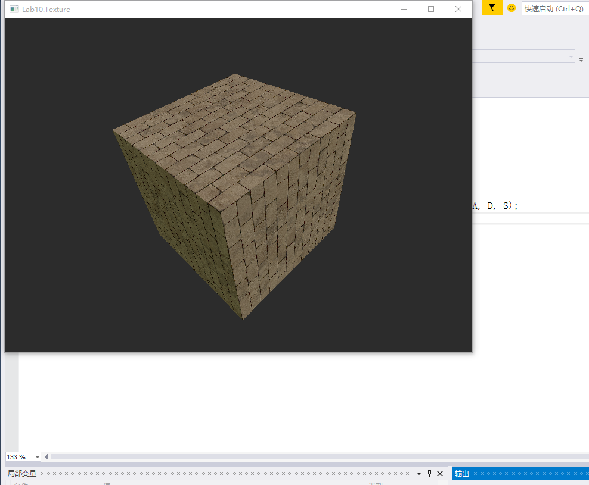
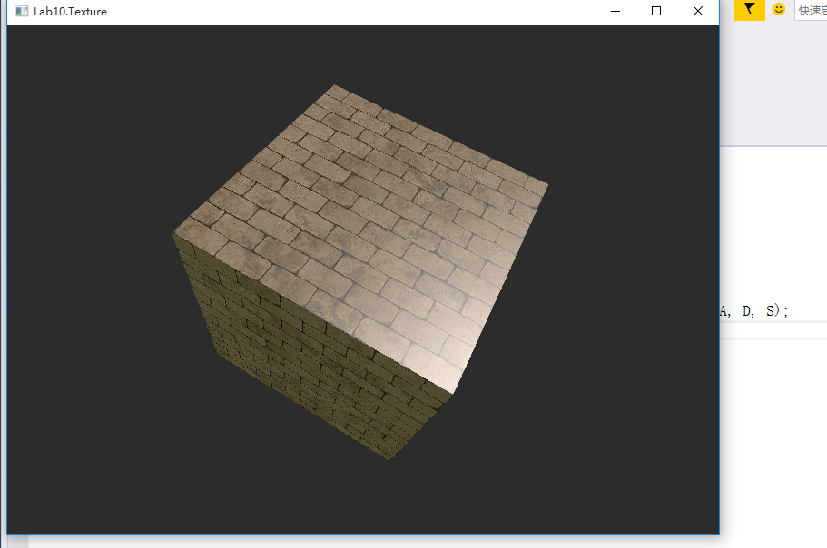
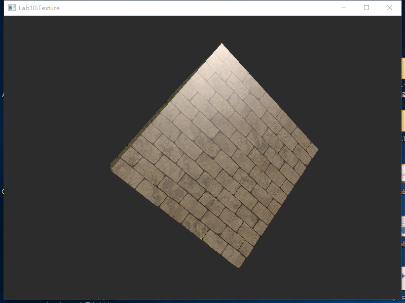

# 华东师范大学计算机科学与技术实验报告

| 实验课程：计算机图形学 | 年级：2018        | 实验成绩：               |
| ---------------------- | ----------------- | ------------------------ |
| 实验名称：材质贴图     | 姓名：李泽浩      | 实验日期：2021/5/18      |
| 实验编号：11           | 学号：10185102142 | 实验时间：pm.13:00-14:40 |
| 指导教师：李洋         | 组号：            |                          |

## 一、实验目的

•利用HLSL实现基本材质贴图。

## 二、实验环境

Windows 10 + visual studio 2019 + D3D 11

## 三、实验内容

•阅读代码

•根据ppt中内容，在main.cpp中创建贴图

•根据ppt内容，在shader中实现贴图渲染

•将贴图渲染结合到phong模型中——将phong材质中albedo替换成贴图的颜色值

## 四、实验原理

##### 纹理映射——几何和图片之间的对应关系


## 五、实验过程总结

shaders中修改内容如下

```c++
//1.在VertexIn VertexOut中增加两行代码
struct VertexIn
{
    float3 position : POS;
    float3 normal : NOR;
      // @TODO : add TEX definition
	float2 texcoord: TEX;

};

struct VertexOut
{
    float4 position : SV_POSITION;
    float3 pos_w : POS;
    float3 normal : NOR;
    // @TODO : add TEX definition
	float2 texcoord: TEX;

};

//2.在shaders最前面增加两个函数声明
Texture2D box_texture : register(t0);
SamplerState box_sampler : register(s0);

//3. float4 ps_main(VertexOut input) : SV_TARGET 中最后修改添加如下代码
float4 tex_color = box_texture.Sample(box_sampler, input.texcoord);
return  tex_color * (ambient + diffuse) + specular;
```

main文件中修改\#include "data2.h" ；UINT stride = 8 * **sizeof**(**float**); 其他部分按照PPT改动即可


运行截图如下：








## 六、附录

