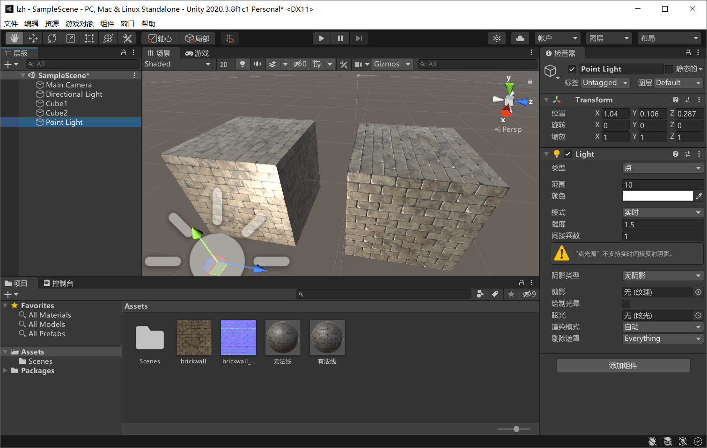
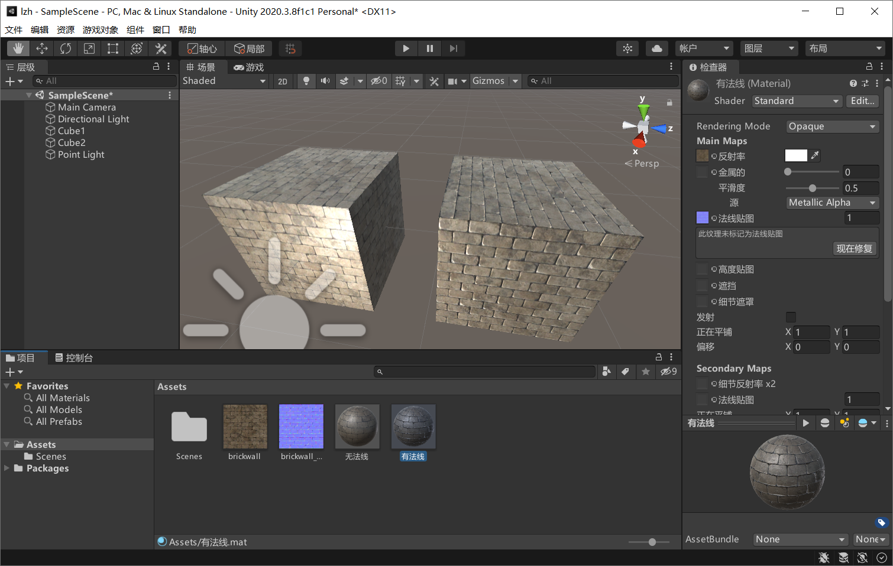
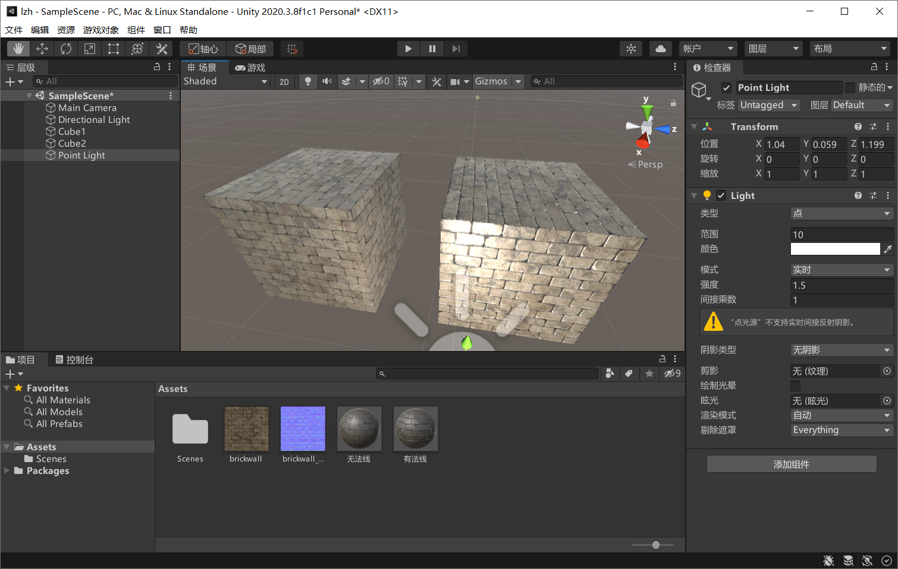
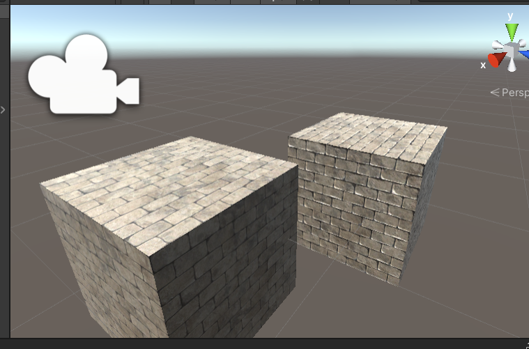
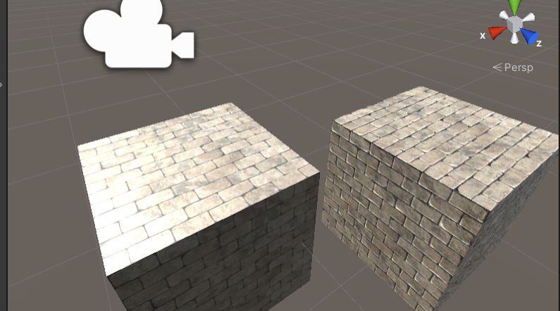

# 华东师范大学计算机科学与技术实验报告

| 实验课程：计算机图形学 | 年级：2018        | 实验成绩：            |
| ---------------------- | ----------------- | --------------------- |
| 实验名称：helloUnity3D | 姓名：李泽浩      | 实验日期：2021/5/25   |
| 实验编号：12           | 学号：10185102142 | 实验时间：13:00-14:40 |
| 指导教师：李洋         | 组号：            |                       |

## 一、实验目的

•利用Unity3D实现法向量材质贴图。

## 二、实验环境

◦Windows 10

◦Unity3D

## 三、实验内容

◦熟悉Unity3D游戏引擎

◦根据ppt中内容，创建一个带贴图的cube

◦根据ppt内容，创建一个带法线贴图的cube

## 四、实验过程与分析

创建无法线特图的立方体

创建并添加带有发线贴图的立方体（右侧立方体）

在左右两侧添加点光源观察两个立方体纹理

## 五、实验过程总结

生成的立方体如下：（左侧为无法线贴图的立方体，右侧为添加了法线贴图的立方体）

可以看到添加了法线贴图的立方体纹理更真实

## 六、附录

