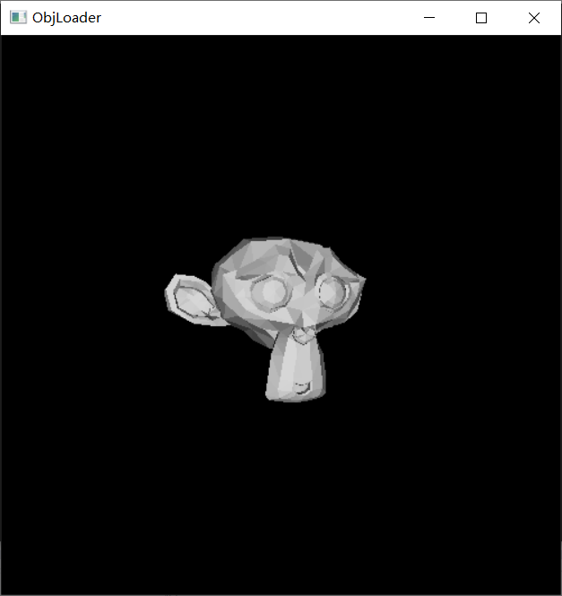
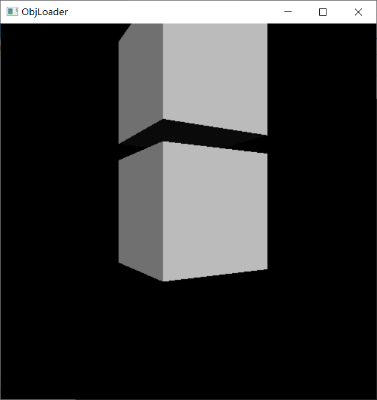

# 华东师范大学计算机科学与技术实验报告

| 实验课程：计算机视觉     | 年级：2018        | 实验成绩：            |
| ------------------------ | ----------------- | --------------------- |
| 实验名称：网格及三维模型 | 姓名：李泽浩      | 实验日期：2021/6/1    |
| 实验编号：13             | 学号：10185102142 | 实验时间：13:00-14:40 |
| 指导教师：李洋           | 组号：            |                       |

## 一、实验目的

•实现三维模型的导入与渲染。

•实验内容与实验步骤：

​	◦根据之前的实验内容

​	◦修改代码

​	◦读入.obj文件

​	◦绘制mesh


## 二、实验环境

◦Windows 10

◦D3DX

◦OpenGL


## 三、实验原理

（1）3D模型：
		•先把该物体放在一个虚拟的三维坐标系中，该坐标称为局部坐标系(Local Space), 一般以物体的中心作为坐标原点，采用左手坐标系。 
		•然后，对坐标系中的物体进行点采样, 这些采样点按一定顺序连接成为一系列的小平面, 这些小平面称为图元(Primitive), 3D引擎会处理每一个图元，称为一个独立的渲染单位。这样取样后的物体看起来像是由许许多多的三角形，四边形或五边形组成的，就像网一样，我们称为一个网格(Mesh).
		•这个采样过程又可称为物体的3D建模, 当然现在都有功能非常强大的3D建模工具，例如3D Max。

（2）OBJ格式说明：
		•OBJ是Wavefront科技开发的一种几何体图形文件格式。该格式最初是为动画工具Advanced Visualizer开发，现已开放，很多其它三维图形软件中都有使用。
		•OBJ 文件格式是表示三维几何图形的简单数据格式，包含每个顶点的位置、UV位置、法线，以及组成面（多边形）的顶点列表等数据。因为该格式中的顶点默认均以逆时针方向存储，所以无需保存面法线数据。虽然 OBJ 文件格式中的坐标没有具体的单位，但是文件中可以以注释的形式标注缩放信息。


## 四、实验过程与分析

main.cpp

```c++
#include "ObjLoader.h"
using namespace std;

string filePath = "data/monkey.obj";
ObjLoader objModel = ObjLoader(filePath);
static float c = 3.1415926 / 180.0f;
static float r = 1.0f;
static int degree = 90;
static int oldPosY = -1;
static int oldPosX = -1;

void setLightRes() {
	GLfloat lightPosition[] = { 0.0f, 0.0f, 1.0f, 0.0f };
	glLightfv(GL_LIGHT0, GL_POSITION, lightPosition);
	glEnable(GL_LIGHTING); //∆Ù”√π‚‘¥
	glEnable(GL_LIGHT0);   // π”√÷∏∂®µ∆π‚
}

void init() {
	glutInitDisplayMode(GLUT_DOUBLE | GLUT_RGB | GLUT_DEPTH);
	glutInitWindowSize(500, 500);
	glutCreateWindow("ObjLoader");
	glEnable(GL_DEPTH_TEST);
	glShadeModel(GL_SMOOTH);
	setLightRes();
	glEnable(GL_DEPTH_TEST);
	//objModel.Init();
}

void display()
{
	glColor3f(1.0, 1.0, 1.0);
	glClear(GL_COLOR_BUFFER_BIT | GL_DEPTH_BUFFER_BIT);
	glMatrixMode(GL_MODELVIEW);                            
	glLoadIdentity();                                     
	glTranslatef(0.0f, 0.0f, -5.0f);              												
	setLightRes();
	glPushMatrix();
	gluLookAt(r*cos(c*degree), 0, r*sin(c*degree), 0.0f, 0.0f, 0.0f, 0.0f, 1.0f, 0.0f);
	objModel.Draw();
	glPopMatrix();
	glutSwapBuffers();
}

void reshape(int width, int height)
{
	glViewport(0, 0, width, height);
	glMatrixMode(GL_PROJECTION);
	glLoadIdentity();
	gluPerspective(60.0f, (GLdouble)width / (GLdouble)height, 1.0f, 200.0f);
	glMatrixMode(GL_MODELVIEW);
}

void moseMove(int button, int state, int x, int y)
{
	if (state == GLUT_DOWN) {
		oldPosX = x; oldPosY = y;
	}
}

void changeViewPoint(int x, int y)
{
	int temp = x - oldPosX;
	degree += temp;
	oldPosX = x;
	oldPosY = y;
}

void myIdle()
{
	glutPostRedisplay();
}

int main(int argc, char* argv[])
{
	glutInit(&argc, argv);
	init();
	glutDisplayFunc(display);
	glutReshapeFunc(reshape);
	glutMouseFunc(moseMove);
	glutMotionFunc(changeViewPoint);
	glutIdleFunc(myIdle);
	glutMainLoop();
	return 0;
}
```


ObjLoader.cpp中实现功能

```c++
#include "ObjLoader.h"
#include <fstream>
#include <iostream>
using namespace std;

//GLfloat m = 1.0f;

ObjLoader::ObjLoader(string filename)
{
	string line;
	fstream f;
	f.open(filename, ios::in);
	if (!f.is_open()){
		cout << "Something Went Wrong When Opening Objfiles" << endl;
	}

	while (!f.eof()){
		getline(f, line);
		vector<string>parameters;
		string tailMark = " ";
		string ans = "";
		line = line.append(tailMark);
		for (int i = 0; i < line.length(); i++) {
			char ch = line[i];
			if (ch != ' ') {
				ans+=ch;
			}
			else {
				parameters.push_back(ans);
				ans = "";
			}
		}

		//cout << parameters.size() << endl;

		if (parameters.size() != 4) {
			cout << "the size is not correct" << endl;
		}
		else {
			if (parameters[0] == "v") {
				vector<GLfloat>Point;
				for (int i = 1; i < 4; i++) {
					GLfloat xyz = atof(parameters[i].c_str());
					Point.push_back(xyz);
				}
				vSets.push_back(Point);
			}
			else if (parameters[0] == "f") {
				vector<GLint>vIndexSets;
				for (int i = 1; i < 4; i++){
					string x = parameters[i];
					string ans = "";
					for (int j = 0; j < x.length(); j++) {
						char ch = x[j];
						if (ch != '/') {
							ans += ch;
						}
						else {
							break;
						}
					}
					GLint index = atof(ans.c_str());
					index = index--;
					vIndexSets.push_back(index);
				}
				fSets.push_back(vIndexSets);
			}
		}
	}
	f.close();
}


void ObjLoader::Draw(){
	glBegin(GL_TRIANGLES);
	for (int i = 0; i < fSets.size(); i++) {
		GLfloat VN[3];
		//three vertex represrnt a surface
		GLfloat SV1[3];
		GLfloat	SV2[3];
		GLfloat SV3[3];

		/*GLfloat EV1[3];
		GLfloat	EV2[3];
		GLfloat EV3[3];

		GLfloat SV1[3];
		GLfloat	SV2[3];
		GLfloat SV3[3];*/

		if ((fSets[i]).size() != 3) {
			cout << "the fSetsets_Size is not correct" << endl;
		}

		else {
				GLint firstVertexIndex = (fSets[i])[0];
				GLint secondVertexIndex = (fSets[i])[1];
				GLint thirdVertexIndex = (fSets[i])[2];

				/*V1[0] = (vSets[firstVertexIndex])[0];
				V1[1] = (vSets[firstVertexIndex])[1];
				V1[2] = (vSets[firstVertexIndex])[2];

				V2[0] = (vSets[secondVertexIndex])[0];
				V2[1] = (vSets[secondVertexIndex])[1];
				V2[2] = (vSets[secondVertexIndex])[2];

				V3[0] = (vSets[thirdVertexIndex])[0];
				V3[1] = (vSets[thirdVertexIndex])[1];
				V3[2] = (vSets[thirdVertexIndex])[2];*/
				SV1[0] = (vSets[firstVertexIndex])[0];
				SV1[1] = (vSets[firstVertexIndex])[1];
				SV1[2] = (vSets[firstVertexIndex])[2];

				SV2[0] = (vSets[secondVertexIndex])[0];
				SV2[1] = (vSets[secondVertexIndex])[1];
				SV2[2] = (vSets[secondVertexIndex])[2];

				SV3[0] = (vSets[thirdVertexIndex])[0];
				SV3[1] = (vSets[thirdVertexIndex])[1];
				SV3[2] = (vSets[thirdVertexIndex])[2];

				/*GLfloat lv1 = sqrt(V1[0] * V1[0] + V1[1] * V1[1] + V1[2] * V1[2]);
				GLfloat lv2 = sqrt(V2[0] * V2[0] + V2[1] * V2[1] + V2[2] * V2[2]);
				GLfloat lv3 = sqrt(V3[0] * V3[0] + V3[1] * V3[1] + V3[2] * V3[2]);

				GLfloat proportion1 = lv1 / morphR;
				GLfloat proportion2 = lv2 / morphR;
				GLfloat proportion3 = lv3 / morphR;

				EV1[0] = V1[0] / proportion1;
				EV1[1] = V1[1] / proportion1;
				EV1[2] = V1[2] / proportion1;

				EV2[0] = V2[0] / proportion2;
				EV2[1] = V2[1] / proportion2;
				EV2[2] = V2[2] / proportion2;

				EV3[0] = V3[0] / proportion3;
				EV3[1] = V3[1] / proportion3;
				EV3[2] = V3[2] / proportion3;

				SV1[0] = EV1[0] * step + (1 - step) * V1[0];
				SV1[1] = EV1[1] * step + (1 - step) * V1[1];
				SV1[2] = EV1[2] * step + (1 - step) * V1[2];

				SV2[0] = EV2[0] * step + (1 - step) * V2[0];
				SV2[1] = EV2[1] * step + (1 - step) * V2[1];
				SV2[2] = EV2[2] * step + (1 - step) * V2[2];

				SV3[0] = EV3[0] * step + (1 - step) * V3[0];
				SV3[1] = EV3[1] * step + (1 - step) * V3[1];
				SV3[2] = EV3[2] * step + (1 - step) * V3[2];*/

				//if there is no vn in the objfile
				//if (vnSets.size() == 0) {
					GLfloat vec1[3], vec2[3], vec3[3];
					//(x2-x1,y2-y1,z2-z1)
					vec1[0] = SV1[0] - SV2[0];
					vec1[1] = SV1[1] - SV2[1];
					vec1[2] = SV1[2] - SV2[2];

					//(x3-x2,y3-y2,z3-z2)
					vec2[0] = SV1[0] - SV3[0];
					vec2[1] = SV1[1] - SV3[1];
					vec2[2] = SV1[2] - SV3[2];

					//(x3-x1,y3-y1,z3-z1)
					vec3[0] = vec1[1] * vec2[2] - vec1[2] * vec2[1];
					vec3[1] = vec2[0] * vec1[2] - vec2[2] * vec1[0];
					vec3[2] = vec2[1] * vec1[0] - vec2[0] * vec1[1];

					GLfloat D = sqrt(pow(vec3[0], 2) + pow(vec3[1], 2) + pow(vec3[2], 2));

					VN[0] = vec3[0] / D;
					VN[1] = vec3[1] / D;
					VN[2] = vec3[2] / D;

					glNormal3f(VN[0], VN[1], VN[2]);
				//}

				//if already have vn
				/*else {
					if (i < vnSets.size()) {
						VN[0] = (vnSets[i])[0];
						VN[1] = (vnSets[i])[1];
						VN[2] = (vnSets[i])[2];
						glNormal3f(VN[0], VN[1], VN[2]);
					}
				}*/

				glVertex3f(SV1[0], SV1[1], SV1[2]);
				glVertex3f(SV2[0], SV2[1], SV2[2]);
				glVertex3f(SV3[0], SV3[1], SV3[2]);			
		}
	}
	glEnd();
	//lastFrameTime = currentFrameTime;
}
```


## 五、实验过程总结

data中monkey.obj文件为：


导出模型显示为：




另导出一个柱子模型：




## 六、附录

