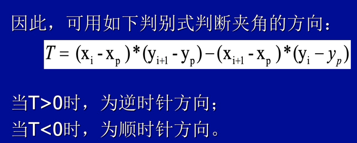
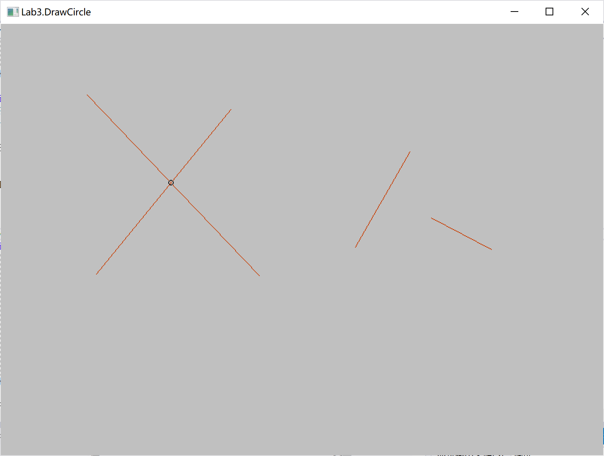
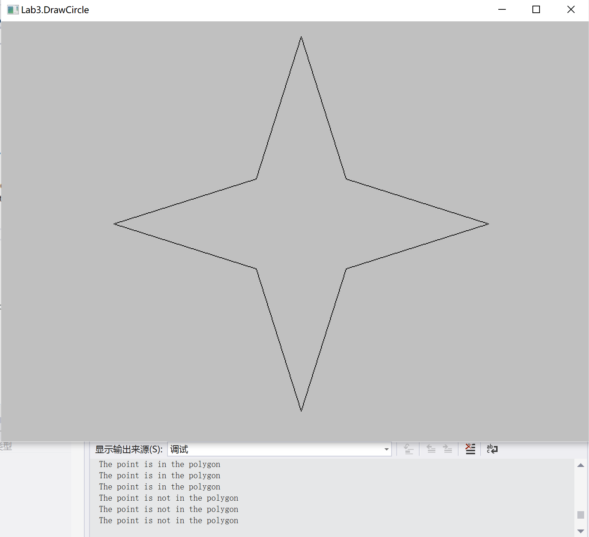

# 华东师范大学计算机科学与技术实验报告

| 实验课程：计算机图形学 | 年级：2018        | 实验成绩：            |
| ---------------------- | ----------------- | --------------------- |
| 实验名称：二维几何     | 姓名：李泽浩      | 实验日期：2021/04/06  |
| 实验编号：6            | 学号：10185102142 | 实验时间：13:00-14:40 |
| 指导教师：李洋         | 组号：            |                       |

## 一、实验目的

◦实现基本2维向量操作

◦计算两个线段的相交点的坐标

◦判断一个点是否在多边形内部

## 二、实验环境

windows 10 & C++ & visual stadio 2019

## 三、实验内容

#### 1.计算两线段交点


#### 2.判断点是否在多边形内

•夹角和法	

◦判断方向





•交点数法	

◦数一下交点的数量


## 四、实验过程与分析

#### 1.补充geometry.hpp中的向量运算函数


#### 2.补充geometry.cpp中的“is_intersection”函数

```c++
bool is_intersection(const Segment &A, const Point &p) 
{
	Vector a(A.e.x - A.s.x, A.e.y - A.s.y);
	Vector b(p.x - A.s.x, p.y - A.s.y);
	float r;
	r = a.cross_prod(b);
	r = int(r + 0.5);
	if (r == 0 and p.x <= max(A.e.x, A.s.x) and 
      p.y <= max(A.e.y, A.s.y) and 
      p.x >= min(A.e.x, A.s.x) and 
      p.y >=min(A.e.y, A.s.y))
	{
    	return true;
	}
  return false;
}
```


#### 3.补充geometry.cpp中的"calc_intersection"函数，计算两线段交点坐标

```c++
bool calc_intersection(const Segment &A, const Segment &B, Point &inter_point) 
{
	float a1, b1, c1, a2, b2, c2, x, y;
	a1 = A.s.y - A.e.y;
	b1 = A.e.x - A.s.x;
	c1 = A.s.x * A.e.y - A.e.x * A.s.y;
	a2 = B.s.y - B.e.y;
	b2 = B.e.x - B.s.x;
	c2 = B.s.x * B.e.y - B.e.x * B.s.y;
	x = (b1 * c2 - c1 * b2) / (b2 * a1 - a2 * b1);
	y = (a1 * c2 - a2 * c1) / (a2 * b1 - a1 * b2);
	inter_point.x = x;
	inter_point.y = y;
	if (is_intersection(A, inter_point) and is_intersection(B, inter_point))
	{
		return true;
	}
  return false;
}
```


#### 4.补充geometry.cpp中的"is_point_inside_polygon"函数，判断点是否在多边形内

```c++
bool is_point_inside_polygon(const Point &p, const Polygon &poly) 
{
	int nCount = poly.size();
	int nCross = 0;
	for (int i = 0; i < nCount; i++)
	{
		Point p1 = poly[i];
		Point p2 = poly[(i + 1) % nCount]; 

		if (p1.y == p2.y)
			continue;
		if (p.y < min(p1.y, p2.y))
			continue;
		if (p.y >= max(p1.y, p2.y))
			continue;
		double x = (double)(p.y - p1.y) * (double)(p2.x - p1.x) / (double)(p2.y - p1.y) + p1.x;
		if (x > p.x)
		{
			nCross++;
		}
	}
	if ((nCross % 2) == 1) return true;
  return false;
}
```


## 五、实验过程总结

运行结果如下

先画两条相交点线段，显示并查看交点；再画两条不相交点线段，不显示交点位置




在助教写好的多边形，内部和外部随机点击几处，并显示是否在多边形内：




## 六、附录
