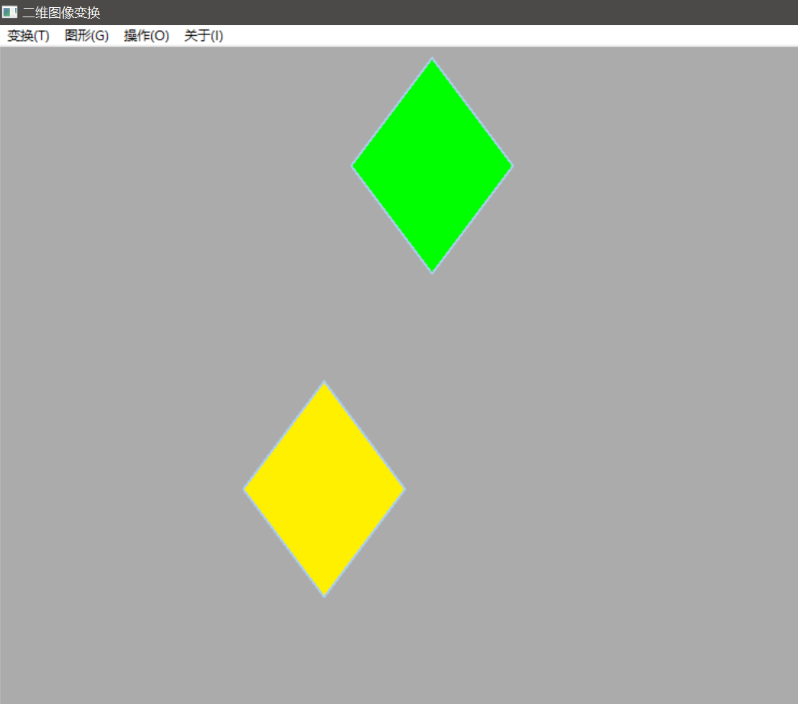
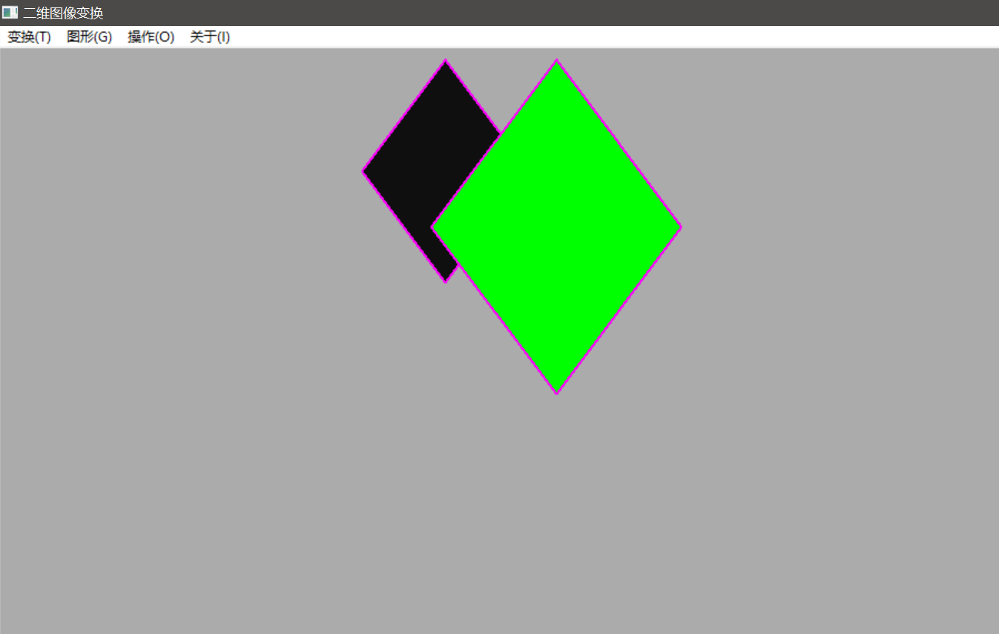

# 第四次实验报告


> 姓名:李泽浩
>
> 学号:10185102142
>
> 日期:2021/4/13


#### 问题描述:

对前几次实验所绘制的图形进行平移、旋转和放缩等操作


#### 求解思路:

- 将二维的坐标写为齐次坐标，即在坐标后面加个1，扩充为3行1列的矩阵

  $$\left[ \begin{matrix} x \\ y \\ 1 \end{matrix} \right]$$

- 对于变换的矩阵：

  - 平移变换，其矩阵形式为：

    $$\left[ \begin{matrix} 1 & 0 & t~x~ \\ 0 & 1 & t~y~ \\ 0 & 0 & 1\end{matrix} \right]$$

    其中t~x~和t~y~是在x和y方向上平移的距离

  - 旋转变换，其矩阵形式为:

    $$\left[ \begin{matrix} cos\theta & -sin\theta & 0 \\ sin\theta & cos\theta & 0 \\ 0 & 0 & 1\end{matrix} \right]$$

    其中$\theta$ 是旋转的角度

  - 放缩变换，其矩阵形式为:
  
    $$\left[ \begin{matrix} S~x~ & 0 & 0 \\ 0 & S~y~ & 0 \\ 0 & 0 & 1\end{matrix} \right]$$
  
    其中S~x~和S~y~分别是在X方向和Y方向的放缩倍数
  
- 对于变换点的坐标，只需要拿变换矩阵左乘点的齐次坐标，即可得到点的坐标


#### 程序代码：

```python
#!/usr/bin/env python
# -*- encoding: utf-8 -*-
'''
@File    :   flat.py
@Time    :   2021/04/12 11:54:36
@Author  :   SleepyPiggy 
@Blog    :   sleepypiggy.life
'''
# here put the import lib

import wx
import numpy as np
import math
import random
import Oval


class Trans2D(wx.Frame):
    def __init__(self):
        super().__init__(None, title="二维图像变换", size=(800, 800))
        self.Center()
        self.initmenu()
        # 设置绘制的设备
        self.dc = wx.ClientDC(self)
        self.dc.SetBackground(wx.Brush(self.GetBackgroundColour()))
        # 随机选择画笔颜色
    def initmenu(self):
        menubar = wx.MenuBar()  # 新建菜单bar

        # 变换选择的菜单
        trans_menu = wx.Menu()
        trans_menu.AppendRadioItem(101, '&平移\tAlt+P')
        trans_menu.AppendRadioItem(102, '&旋转\tAlt+S')
        trans_menu.AppendRadioItem(103, '&放缩\tAlt+Z')
        menubar.Append(trans_menu, '变换(&T)')

        #图形选择的菜单
        graph_menu = wx.Menu()
        graph_menu.AppendRadioItem(201, '&直线\tAlt+L')
        graph_menu.AppendRadioItem(202, '&椭圆\tAlt+O')
        graph_menu.AppendRadioItem(203, '&填充图形\tAlt+F')
        menubar.Append(graph_menu, '图形(&G)')

        # 绘制图形的菜单
        paint_menu = wx.Menu()
        paint_menu.Append(301, '&绘制\tAlt+P')
        menubar.Append(paint_menu, '操作(&O)')

        # 个人信息菜单
        inform_menu = wx.Menu()
        menubar.Append(inform_menu, '关于(&I)')

        # 显示菜单
        self.SetMenuBar(menubar)

        # 绑定自己的绘制函数
        self.Bind(wx.EVT_MENU, self.MyPaint, id=301)

    def MyPaint(self, event):
        self.dc.Clear()
        linecolors = [
            '#671392', '#00FF00', '#FF00FF', '#ABCDEF', '#FEDCBA', '#0F0F0F',
            '#FFF000'
        ]
        # 设置画笔粗细
        width = 2
        # 设置画笔颜色
        color = random.sample(linecolors, 1)[0]
        pen = wx.Pen(color, width=width, style=wx.PENSTYLE_SOLID)
        self.dc.SetPen(pen)
        # 判断各个单选菜单的状态
        # 是否平移
        pan = self.GetMenuBar().FindItemById(101).IsChecked()
        # 是否旋转
        spin = self.GetMenuBar().FindItemById(102).IsChecked()
        # 是否放缩
        zoom = self.GetMenuBar().FindItemById(103).IsChecked()

        # 对于直线进行操作
        line = self.GetMenuBar().FindItemById(201).IsChecked()
        # 对于椭圆进行操作
        oval = self.GetMenuBar().FindItemById(202).IsChecked()
        # 对于封闭图形进行操作
        graph = self.GetMenuBar().FindItemById(203).IsChecked()
        sita = 0
        yzoom = 1
        # 输入平移的参数
        if pan:
            dlg = wx.TextEntryDialog(self, '请分别输入平移x,y坐标', '平移参数')
            if dlg.ShowModal() == wx.ID_OK:
                x0, y0 = map(int, dlg.GetValue().split())
            parameter = 'T'
        # 输入旋转的参数
        if spin:
            dlg = wx.TextEntryDialog(self, '请分别输入旋转中心x,y坐标和旋转角度', '旋转参数')
            if dlg.ShowModal() == wx.ID_OK:
                x0, y0, sita = map(float, dlg.GetValue().split())
            parameter = 'R'

        # 输入放缩的参数
        if zoom:
            dlg = wx.TextEntryDialog(self, '请分别输入放缩中心x,y坐标和x,y的放缩倍数', '旋转参数')
            if dlg.ShowModal() == wx.ID_OK:
                x0, y0, sita, yzoom = map(float, dlg.GetValue().split())
            parameter = 'S'

        # test
        if line:
            # 获取直线的起点和终点
            dlg_graph = wx.TextEntryDialog(self, '请输入直线的起始坐标', '坐标参数')
            # 获取直线端点坐标
            if dlg_graph.ShowModal() == wx.ID_OK:
                lx0, ly0, lx1, ly1 = map(int, dlg_graph.GetValue().split())
            # 绘制初始直线
            self.dc.DrawLine((lx0, ly0), (lx1, ly1))
            # 修改画笔颜色
            color = random.sample(linecolors, 1)[0]
            pen = wx.Pen(color, width=width, style=wx.PENSTYLE_SOLID)
            self.dc.SetPen(pen)
            # 计算变换后顶点坐标
            tx0, ty0 = self.TransFunction(lx0, ly0, x0, y0, parameter, sita,
                                          yzoom)
            tx1, ty1 = self.TransFunction(lx1, ly1, x0, y0, parameter, sita,
                                          yzoom)
            #绘制变换后的直线
            self.dc.DrawLine((tx0, ty0), (tx1, ty1))

        if oval:
            # 获取椭圆的参数
            dlg_graph = wx.TextEntryDialog(self, '请输入椭圆的中心坐标和长短轴', '坐标参数')
            # 获取椭圆的左上角和右上角的点坐标
            if dlg_graph.ShowModal() == wx.ID_OK:
                Ox, Oy, a, b = map(int, dlg_graph.GetValue().split())
            ovalpoints = Oval.Ovalpoints(Ox, Oy, a, b)
            self.dc.DrawPointList(ovalpoints)
            tran_points = []
            for point in ovalpoints:
                ox, oy = point
                tx, ty = self.TransFunction(ox, oy, x0, y0, parameter, sita,
                                            yzoom)
                tran_points.append((tx, ty))
            # 修改画笔颜色
            color = random.sample(linecolors, 1)[0]
            pen = wx.Pen(color, width=width, style=wx.PENSTYLE_SOLID)
            self.dc.SetPen(pen)
            self.dc.DrawPointList(tran_points)

        if graph:
            # 自定义菱形顶点坐标
            lx0, ly0 = 400, 10
            lx1, ly1 = 475, 110
            lx2, ly2 = 400, 210
            lx3, ly3 = 325, 110
            pointlist = [(lx0, ly0), (lx1, ly1), (lx2, ly2), (lx3, ly3)]

            tranlist = []  # 存储变换后的顶点坐标

            # 修改画刷的颜色
            color = random.sample(linecolors, 1)[0]
            brush = wx.Brush(color)
            self.dc.SetBrush(brush)

            # 绘制原始图形
            self.dc.DrawPolygon(pointlist)
            # 计算每个点变化后的坐标
            for point in pointlist:
                x, y = point
                tx, ty = self.TransFunction(x, y, x0, y0, parameter, sita,
                                            yzoom)
                tranlist.append((tx, ty))
            # 修改画刷的颜色
            color = random.sample(linecolors, 1)[0]
            brush = wx.Brush(color)
            self.dc.SetBrush(brush)
            # 绘制变换后的菱形
            self.dc.DrawPolygon(tranlist)

    def TransFunction(self,
                      x,
                      y,
                      x0,
                      y0,
                      para='T',
                      sita=0,
                      yzoom=1):  # 定义 对点进行变化的函数

        if para == 'T':  # 平移矩阵
            matlist = [[1, 0, x0], [0, 1, y0], [0, 0, 1]]
            mat = np.array(matlist)  # 转化为ndarry格式
            point = np.array([[x], [y], [1]])  # 将点转换为齐次坐标
            trans_point = mat.dot(point).tolist()
            trans_x = int(trans_point[0][0])
            trans_y = int(trans_point[1][0])
        if para == 'R':  # 旋转矩阵，需要通过角度换成弧度
            pi = math.pi
            sita = -sita / 180 * pi
            cos = math.cos(sita)
            sin = math.sin(sita)
            matlist = [[cos, -sin, 0], [sin, cos, 0], [0, 0, 1]]
            mat = np.array(matlist)  # 转化为ndarry格式
            point = np.array([[x - x0], [y - y0], [1]])  # 将点转换为齐次坐标
            trans_point = mat.dot(point).tolist()
            trans_x = int(trans_point[0][0] + x0)
            trans_y = int(trans_point[1][0] + y0)
        if para == 'S':  # 放缩矩阵
            matlist = [[sita, 0, 0], [0, yzoom, 0], [0, 0, 1]]
            mat = np.array(matlist)  # 转化为ndarry格式
            point = np.array([[x - x0], [y - y0], [1]])  # 将点转换为齐次坐标
            trans_point = mat.dot(point).tolist()
            trans_x = int(trans_point[0][0] + x0)
            trans_y = int(trans_point[1][0] + y0)
        return trans_x, trans_y


def main():
    app = wx.App()
    trans2d = Trans2D()
    trans2d.Show()
    app.MainLoop()


if __name__ == '__main__':
    main()
```


对于import的Oval文件，是我自己写的计算椭圆上各个点坐标的函数，程序代码如下。

```python
def Ovalpoints(Ox, Oy, a, b):
    changed = 0 if a > b else 1  #用来判断取x或y为主方向
    a, b = max(a, b), min(a, b)
    point_list4 = []  #存储第四象限的点集
    A = a**2
    B = b**2
    x0 = int((A**2 / (A + B))**0.5)  #记录切线斜率为1的点横轴坐标
    x = 0
    y = b

    p = B + A * (0.25 - b)

    while x <= x0:
        if changed:
            point_list4.append((y, x))
        else:
            point_list4.append((x, y))
        if p < 0:
            p += B * (3 + 2 * x)
        else:
            p += B * (3 + 2 * x) + A * (2 - 2 * y)
            y -= 1
        x += 1

    p = B * (x + 0.5)**2 + A * (y - 1)**2 - A * B

    while y > 0:
        if changed:
            point_list4.append((y, x))
        else:
            point_list4.append((x, y))
        if p > 0:
            p += A * (3 - 2 * y)
        else:
            p += A * (3 - 2 * y) + B * (2 * x + 2)
            x += 1
        y -= 1
    point_list1 = [(x, -1 * y) for x, y in point_list4]  #第一象限的点
    point_list2 = [(-1 * x, -1 * y) for x, y in point_list4]  #第二象限的点
    point_list3 = [(-1 * x, y) for x, y in point_list4]  #第三象限的点
    #设置顺时针顺序进行绘画
    point_list1.sort()
    point_list2.sort()
    point_list3.sort(reverse=True)
    point_list4.sort(reverse=True)
    points_O = point_list1 + point_list4 + point_list3 + point_list2

    #平移坐标系
    points = [(x + Ox, y + Oy) for x, y in points_O]
    return points
```


#### 实验结果:


- 平移操作

  

- 旋转操作

  

- 放缩操作

  


#### 实验心得:

- 这个算法厉害之处就是将平移、旋转和放缩这三个变换全部转化为了相同的计算方式，只要使用矩阵左乘齐次坐标即可。
- 对于椭圆的旋转操作，因为wxpython好像不提供旋转的椭圆绘制函数，所以对于椭圆的绘制，我是使用在第二次实验中的函数，来计算椭圆上各个点的坐标，最后通过画点来绘制椭圆。
- 实验还存在一些问题，如果是对于椭圆进行变换操作，如果变换后的椭圆所需点的个数大于原椭圆上的点的个数，所得到的图形虽然也是椭圆的形状，但是中间会有一些稀疏的空隙，因为算法实现的是对于每个点进行变换。
- 虽然算法理解起来比较简单，但是我对于wxpython控件不太熟悉，所以是在查阅了大量资料之后才实现了使用菜单进行绘制的方法，并且函数写的有点臃肿，但是自己也没有想到更好的实现方式，所以对于代码的整洁程度还是有改进的必要。