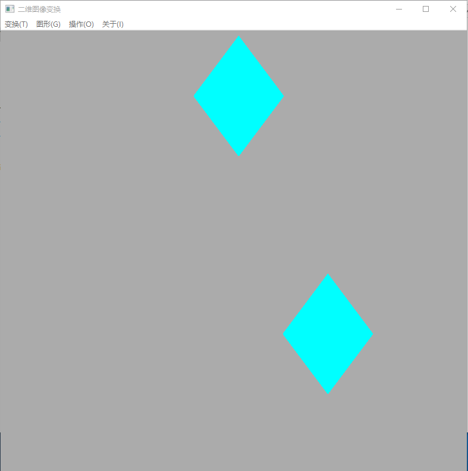
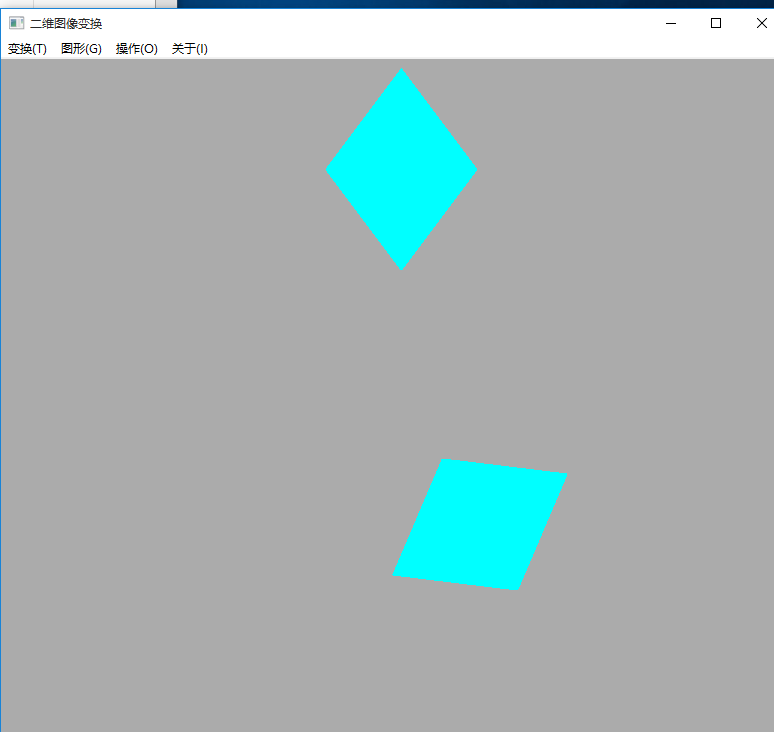
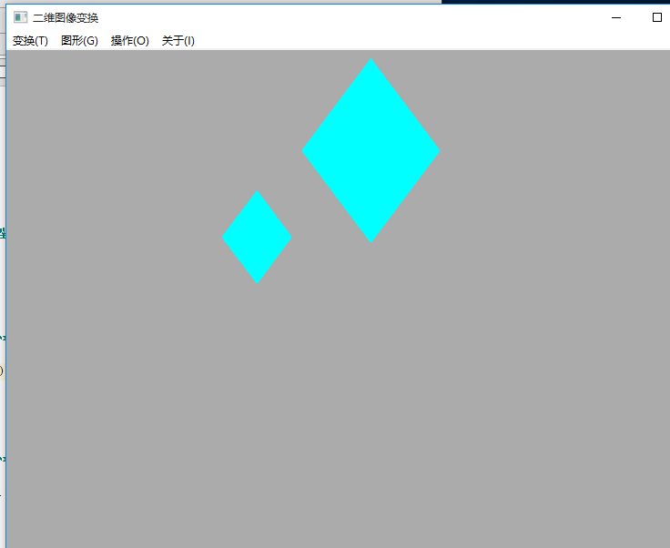

# 华东师范大学计算机科学与技术实验报告

| 实验课程：计算机图形学 | 年级：2018        | 实验成绩：            |
| ---------------------- | ----------------- | --------------------- |
| 实验名称：二维变换     | 姓名：李泽浩      | 实验日期：2021/04/13  |
| 实验编号：7            | 学号：10185102142 | 实验时间：13:00-14:40 |
| 指导教师：李洋         | 组号：            |                       |

## 一、实验目的

实现二维几何图形的

•平移

•缩放

•旋转

## 二、实验环境

macOS + python 3.7 + pycharm


## 三、实验内容

#### •实验内容与实验步骤：

​	◦实现基本2维矩阵操作（齐次坐标系）

​	◦实现平移变换，将poly中心移动回中心

​	◦实现缩放变换，x和y方向各缩放为原来的0.99

​	◦实现旋转变换，旋转0.05度

​	◦将poly移动回原先位置


#### •实验原理：

​	◦将二维的坐标写为齐次坐标，即在坐标后面加个1，扩充为3行1列的矩阵

​	◦平移变换，其矩阵形式为（其中tx和ty是在x和y方向上平移的距离）：

​	◦旋转变换，其矩阵形式为（其中 是旋转的角度）：

​	◦放缩变换，其矩阵形式为（其中Sx和Sy分别是在X方向和Y方向的放缩倍数）：

​	◦对于变换点的坐标，只需要拿变换矩阵左乘点的齐次坐标，即可得到点的坐标

#### 求解思路:

## 四、实验过程与分析

导入必要的库：

```python
import wx
import numpy as np
import math
```

主函数：

```python
ef main():
    app = wx.App()
    trans2d = Trans2D()
    trans2d.Show()
    app.MainLoop()

if __name__ == '__main__':
    main()
```

在类中实现对话框以及图形的绘制、平移、旋转、放缩

```python
class Trans2D(wx.Frame):
    def __init__(self):
        super().__init__(None, title="二维图像变换", size=(800, 800))
        self.Center()
        self.initmenu()
        self.dc = wx.ClientDC(self)
        self.dc.SetBackground(wx.Brush(self.GetBackgroundColour()))
    #菜单栏
    def initmenu(self):
        menubar = wx.MenuBar()  # 新建菜单bar
        # 变换选择的菜单
        trans_menu = wx.Menu()
        trans_menu.AppendRadioItem(101, '&平移\tAlt+P')
        trans_menu.AppendRadioItem(102, '&旋转\tAlt+S')
        trans_menu.AppendRadioItem(103, '&放缩\tAlt+Z')
        menubar.Append(trans_menu, '变换(&T)')
        # 图形选择的菜单
        graph_menu = wx.Menu()
        graph_menu.AppendRadioItem(203, '&填充图形\tAlt+F')
        menubar.Append(graph_menu, '图形(&G)')
        # 绘制图形的菜单
        paint_menu = wx.Menu()
        paint_menu.Append(301, '&绘制\tAlt+P')
        menubar.Append(paint_menu, '操作(&O)')
        # 显示菜单
        self.SetMenuBar(menubar)
        # 绑定自己的绘制函数
        self.Bind(wx.EVT_MENU, self.MyPaint, id=301)
        
		#绘制图形
    def MyPaint(self, event):
        self.dc.Clear()
        linecolors = ['#00FFFF']
        # 设置画笔粗细
        width = 2
        # 设置画笔颜色
        color = linecolors[0]
        pen = wx.Pen(color, width=width, style=wx.PENSTYLE_SOLID)
        self.dc.SetPen(pen)
        # 判断各个单选菜单的状态
        # 是否平移
        pan = self.GetMenuBar().FindItemById(101).IsChecked()
        # 是否旋转
        spin = self.GetMenuBar().FindItemById(102).IsChecked()
        # 是否放缩
        zoom = self.GetMenuBar().FindItemById(103).IsChecked()

        # 对于封闭图形进行操作
        graph = self.GetMenuBar().FindItemById(203).IsChecked()
        sita = 0
        yzoom = 1
        # 输入平移的参数
        if pan:
            dlg = wx.TextEntryDialog(self, '请分别输入平移x,y坐标', '平移参数')
            if dlg.ShowModal() == wx.ID_OK:
                x0, y0 = map(int, dlg.GetValue().split())
            parameter = 'T'
        # 输入旋转的参数
        if spin:
            dlg = wx.TextEntryDialog(self, '请分别输入旋转中心x,y坐标和旋转角度', '旋转参数')
            if dlg.ShowModal() == wx.ID_OK:
                x0, y0, sita = map(float, dlg.GetValue().split())
            parameter = 'R'

        # 输入放缩的参数
        if zoom:
            dlg = wx.TextEntryDialog(self, '请分别输入放缩中心x,y坐标和x,y的放缩倍数', '旋转参数')
            if dlg.ShowModal() == wx.ID_OK:
                x0, y0, sita, yzoom = map(float, dlg.GetValue().split())
            parameter = 'S'

        if graph:
            # 自定义菱形顶点坐标
            lx0, ly0 = 400, 10
            lx1, ly1 = 475, 110
            lx2, ly2 = 400, 210
            lx3, ly3 = 325, 110
            pointlist = [(lx0, ly0), (lx1, ly1), (lx2, ly2), (lx3, ly3)]

            tranlist = []  # 存储变换后的顶点坐标

            # 修改画刷的颜色
            color = linecolors[0]
            brush = wx.Brush(color)
            self.dc.SetBrush(brush)

            # 绘制原始图形
            self.dc.DrawPolygon(pointlist)
            # 计算每个点变化后的坐标
            for point in pointlist:
                x, y = point
                tx, ty = self.TransFunction(x, y, x0, y0, parameter, sita,
                                            yzoom)
                tranlist.append((tx, ty))
            # 设置画刷的颜色
            color = linecolors[0]
            brush = wx.Brush(color)
            self.dc.SetBrush(brush)
            # 绘制变换后的菱形
            self.dc.DrawPolygon(tranlist)
		
    #实现平移/旋转/缩放
    def TransFunction(self,
                      x,
                      y,
                      x0,
                      y0,
                      para='T',
                      sita=0,
                      yzoom=1):  # 定义 对点进行变化的函数

        if para == 'T':  # 平移矩阵
            matlist = [[1, 0, x0], [0, 1, y0], [0, 0, 1]]
            mat = np.array(matlist)  # 转化为ndarry格式
            point = np.array([[x], [y], [1]])  # 将点转换为齐次坐标
            trans_point = mat.dot(point).tolist()
            trans_x = int(trans_point[0][0])
            trans_y = int(trans_point[1][0])
        if para == 'R':  # 旋转矩阵，需要通过角度换成弧度
            pi = math.pi
            sita = -sita / 180 * pi
            cos = math.cos(sita)
            sin = math.sin(sita)
            matlist = [[cos, -sin, 0], [sin, cos, 0], [0, 0, 1]]
            mat = np.array(matlist)  # 转化为ndarry格式
            point = np.array([[x - x0], [y - y0], [1]])  # 将点转换为齐次坐标
            trans_point = mat.dot(point).tolist()
            trans_x = int(trans_point[0][0] + x0)
            trans_y = int(trans_point[1][0] + y0)
        if para == 'S':  # 放缩矩阵
            matlist = [[sita, 0, 0], [0, yzoom, 0], [0, 0, 1]]
            mat = np.array(matlist)  # 转化为ndarry格式
            point = np.array([[x - x0], [y - y0], [1]])  # 将点转换为齐次坐标
            trans_point = mat.dot(point).tolist()
            trans_x = int(trans_point[0][0] + x0)
            trans_y = int(trans_point[1][0] + y0)
        return trans_x, trans_y

```


## 五、实验过程总结

#### 1.平移结果如下：



#### 2.旋转结果如下：



#### 3.缩放结果如下：



## 六、附录

