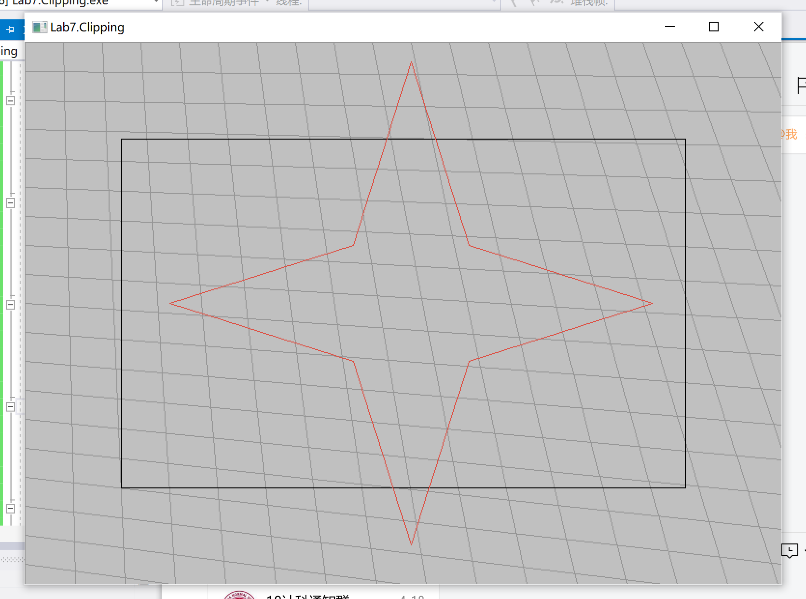
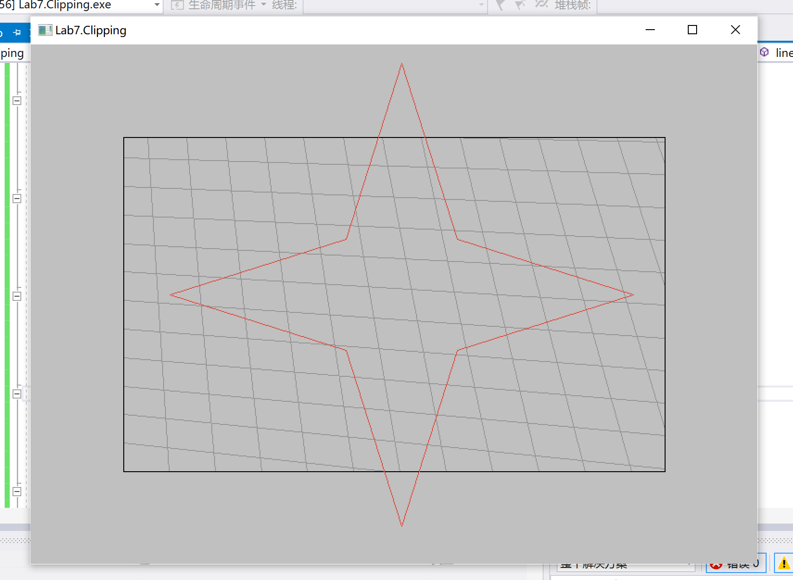
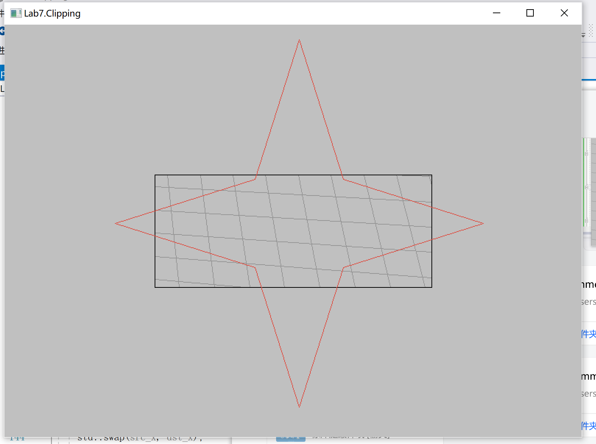
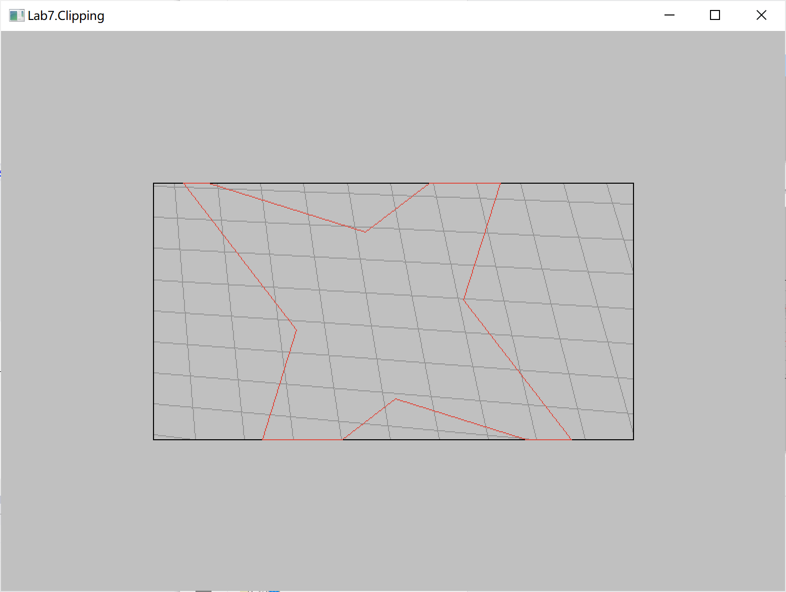
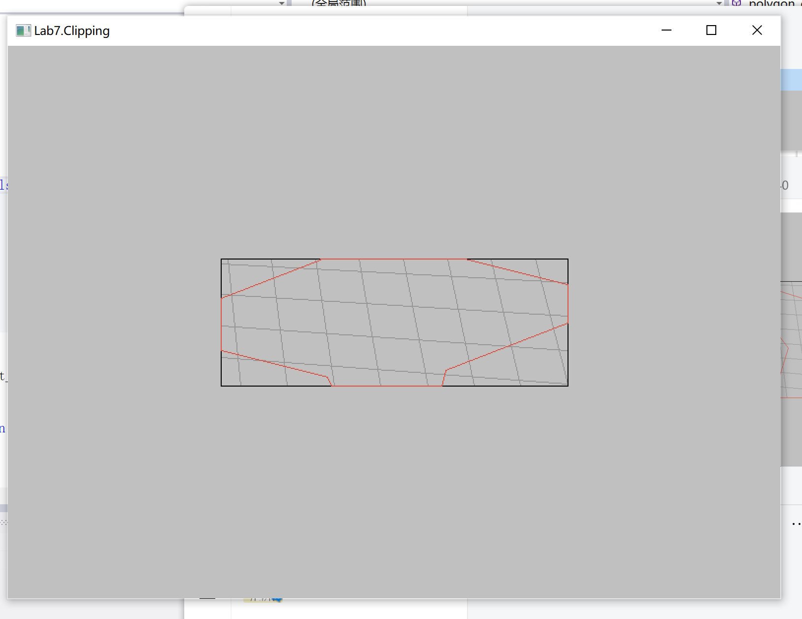

# 华东师范大学计算机科学与技术实验报告

| 实验课程：计算机图形学 | 年级：2018        | 实验成绩：            |
| ---------------------- | ----------------- | --------------------- |
| 实验名称：剪裁算法     | 姓名：李泽浩      | 实验日期：2021/04/20  |
| 实验编号：7            | 学号：10185102142 | 实验时间：13:00-14:40 |
| 指导教师：李洋         | 组号：            |                       |

## 一、实验目的

利用操作系统API实现基本裁剪算法。


## 二、实验环境

Visual studio 2019 + Windows 10


## 三、实验内容

- ##### 实现Sutherland-Cohen编码算法

- ##### 实现直线剪裁算法

- ##### 实现多边形剪裁算法


## 四、实验过程与分析

#### ·Sutherland-Cohen编码算法

算法原理：


```c++
OutCode calc_OutCode(const Vector2 &P, const Vector2 &clip_min,
                     const Vector2 &clip_max) {
  OutCode code = INSIDE;
  // Write you code here
  //int x = P.x, y = P.y;
  if (P.x() < clip_min.x()) code |= LEFT;
  if (P.x() > clip_max.x()) code |= RIGHT;
  if (P.y() < clip_min.y()) code |= TOP;
  if (P.y() > clip_max.y()) code |= BOTTOM;
  return code;
}
```


#### ·直线剪裁算法

算法原理：


```c++
bool line_clip_CohenSutherland(Vector2 &p0, Vector2 &p1,
                               const Vector2 &clip_min,
                               const Vector2 &clip_max) {
  OutCode code0 = calc_OutCode(p0, clip_min, clip_max);
  OutCode code1 = calc_OutCode(p1, clip_min, clip_max);
  auto x0 = p0.x(), y0 = p0.y();
  auto x1 = p1.x(), y1 = p1.y();
  auto min_x = clip_min.x(), min_y = clip_min.y();
  auto max_x = clip_max.x(), max_y = clip_max.y();
  bool accept = false;

    // Write you code here
  while (true)
  {
	  if ((code0 | code1) == 0) {
		  accept = true;
		  break;
	  }
	  if ((code0 & code1) != 0){
		  break;
	  }
	  OutCode code_out = code1 > code0 ? code1 : code0;
	  double x, y;
	  if ((code_out & LEFT) != 0) //在左边
	  {
		  x = clip_min.x();
		  if (x1 == x0)  y = y0;
		  else y = (int)(y0 + (y1 - y0)*(min_x - x0) / (x1 - x0));
	  }
	  else if ((code_out & RIGHT) != 0) //在右边
	  {
		  x = clip_max.x();
		  if (x1 == x0)  y = y0;
		  else y = (int)(y0 + (y1 - y0)*(max_x - x0) / (x1 - x0));
	  }
	  else if ((code_out & BOTTOM) != 0) //在下边
	  {
		  y = clip_max.y();
		  if (y1 == y0)  x = x0;
		  else x = (int)(x0 + (x1 - x0)*(max_y - y0) / (y1 - y0));
	  }
	  else if ((code_out & TOP) != 0) //在上边
	  {
		  y = clip_min.y();
		  if (y1 == y0)  x = x0;
		  else x = (int)(x0 + (x1 - x0)*(min_y - y0) / (y1 - y0));
	  }
	  if (code_out == code0)
	  {
		  x0 = x;
		  y0 = y;
		  p0 = { x0, y0 };
	  }
	  else
	  {
		  x1 = x;
		  y1 = y;
		  p1 = { x1, y1 };
	  }
	  code0 = calc_OutCode(p0, clip_min, clip_max);
	  code1 = calc_OutCode(p1, clip_min, clip_max);
  }

  // Set clip result in p0 & p1
  p0 = {x0, y0};
  p1 = {x1, y1};
  return accept;
}
```


#### ·多边形裁剪算法

算法原理及伪代码：


```c++
//use LEFT to cut
std::vector<Vector2> input_poly; 
  for (int i = 0; i < output_poly.size(); i++) 
  {	
	  int j;
	  if (i == (output_poly.size()-1)) j = 0;
	  else j = i + 1;
	  Vector2 p0, p1;
	  p0 = output_poly[i];
	  p1 = output_poly[j];
	  OutCode code0 = calc_OutCode(p0, clip_min, clip_max);
	  OutCode code1 = calc_OutCode(p1, clip_min, clip_max);
	  auto x0 = p0.x(), y0 = p0.y();
	  auto x1 = p1.x(), y1 = p1.y();
	  auto min_x = clip_min.x(), min_y = clip_min.y();
	  auto max_x = clip_max.x(), max_y = clip_max.y();
	  if (((code0 & LEFT) == 0) && ((code1 & LEFT) == 0)) 
	  {
		  input_poly.push_back(p1);
	  }
	  else if (((code0 & LEFT) != 0) && ((code1 & LEFT) == 0)) //右
	  {
		  double x, y;
		  x = clip_min.x();
		  y = (int)(y0 + (y1 - y0)*(min_x - x0) / (x1 - x0));
		  Vector2 p;
		  p = {x,y};
		  input_poly.push_back(p);
		  input_poly.push_back(p1);
	  }
	  else if (((code0 & LEFT) == 0) && ((code1 & LEFT) != 0)) //左
	  {
		  double x, y;
		  x = clip_min.x();
		  y = (int)(y0 + (y1 - y0)*(min_x - x0) / (x1 - x0));
		  Vector2 p;
		  p = {x,y};
		  input_poly.push_back(p);
	  }
	  
  }
  output_poly = input_poly;
```


## 五、实验过程总结

原图：



#### ·直线剪裁算法结果：






#### ·多边形剪裁算法：






## 六、附录

在macOS上利用python的wx库进行直线裁剪（附件lab7.py）文件


