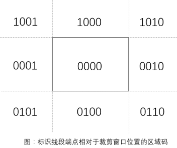
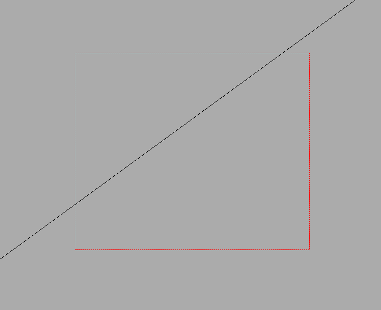
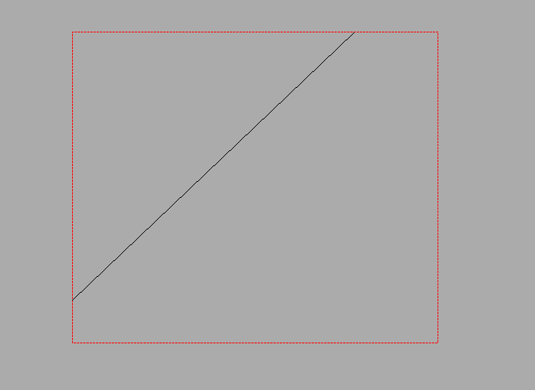

<div align='center' ><font size=30>第五次实验报告</font></div>


| 实验课程：计算机图形学 |              姓名：徐泽庭              |  学号:10185102108   |
| :--------------------: | :------------------------------------: | :-----------------: |
|    指导老师：李海晟    | 实验名称：Cohen-Sutherland线段裁剪算法 | 实验时间：2021/4/19 |


#### 问题描述: 

​	**编程实现段裁剪，算法可以是Cohen-Sutherland或者Liang-Barsky。**

#### 求解思路:

- 利用线段的裁剪区域，将平面划分为九个区域，并进行编码，编码的顺序是上下右左。

  

- 接着给线段的端点匹配对应的区域码。

- 进行判断：

  - 如果线段的区域码进行**位或**操作之后，所得结果**为0**， 说明线段在区域内部，不做更改

  - 如果线段的区域码进行**位与**操作之后，所得结果**不为0**，说明线段在区域外部，不作画

  - 其他情况下：

    要测试线段与区域的交点

    使用循环进行特定的顺序更新

    直到我们最后裁剪的直线线段均位于裁剪区域内部


#### 程序代码:

```python
import wx

TOP = 8  # 1000
BOTTOM = 4  # 0100
RIGHT = 2  # 0010
LEFT = 1  # 0001
INSIDE = 0  # 0000


class Crop(wx.Frame):
    def __init__(self):
        super().__init__(None, title='线段裁剪算法', size=(800, 800))
        self.Center()

        # 绑定用户交互的函数
        self.Bind(wx.EVT_LEFT_DOWN, self.left_down)
        self.Bind(wx.EVT_LEFT_UP, self.left_up)
        self.Bind(wx.EVT_MOTION, self.mouse_move)

        # 设置绘制的设备
        self.dc1 = wx.ClientDC(self)
        self.dc1.SetBackground(wx.Brush(self.GetBackgroundColour()))
        self.dc2 = wx.ClientDC(self)
        self.dc2.SetBackground(wx.Brush(self.GetBackgroundColour()))
        # 设置绘制的画笔和画刷颜色
        brush_color = '#000000'
        brush = wx.Brush(brush_color, wx.TRANSPARENT)
        pen_color = '#ff0000'
        pen = wx.Pen(pen_color, width=1, style=wx.PENSTYLE_LONG_DASH)
        self.dc2.SetBrush(brush)
        self.dc2.SetPen(pen)

        self.flag = False
        self.line_posx0 = 0  # 直线起点坐标的x值
        self.line_posy0 = 0  # 直线终点坐标的y值
        self.line_posx1 = 0  # 直线终点坐标的x值
        self.line_posy1 = 0  # 直线终点坐标的y值
        self.rec_posx0 = 0  # 矩形起点坐标的x值
        self.rec_posy0 = 0  # 矩形起点坐标的y值
        self.rec_posx1 = 0  # 矩形终点坐标的x值
        self.rec_posy1 = 0  # 矩形终点坐标的y值

    def left_down(self, event):
        # 获取绘制直线或矩形的起始坐标值
        pos = event.GetPosition()
        if self.flag:
            self.rec_posx0, self.rec_posy0 = pos
        else:
            self.line_posx0, self.line_posy0 = pos

    def mouse_move(self, event):
        # 动态绘制直线或矩形的函数
        if self.flag:
            # 绘制矩形
            if event.Dragging() and event.LeftIsDown():
                self.dc2.Clear()
                self.dc1.DrawLine(self.line_posx0, self.line_posy0,
                                  self.line_posx1, self.line_posy1)

                self.rec_posx1, self.rec_posy1 = event.GetPosition()
                # 计算矩形的宽度和高度并绘制
                width = self.rec_posx1 - self.rec_posx0
                height = self.rec_posy1 - self.rec_posy0
                self.dc2.DrawRectangle(self.rec_posx0, self.rec_posy0, width,
                                       height)
        else:
            # 绘制直线
            if event.Dragging() and event.LeftIsDown():
                self.dc1.Clear()
                self.line_posx1, self.line_posy1 = event.GetPosition()
                self.dc1.DrawLine(self.line_posx0, self.line_posy0,
                                  self.line_posx1, self.line_posy1)

    def left_up(self, event):
        
        
        if self.flag:
            # 确定矩形区域之后
            # 计算裁剪之后的线段端点
            accept,linex0,liney0,linex1,liney1 = self.compute(self.line_posx0,self.line_posy0,self.line_posx1,self.line_posy1)
            self.dc1.Clear()
            width = self.rec_posx1 - self.rec_posx0
            height = self.rec_posy1 - self.rec_posy0
            self.dc2.DrawRectangle(self.rec_posx0, self.rec_posy0, width,
                                       height)
            if accept:
                self.dc1.DrawLine(linex0,liney0,linex1,liney1)
        # 每次鼠标左键up之后切换绘制的形状
        self.flag = not self.flag

    def Code(self, x, y):
        """
        x,y 指目标点的坐标
        x0,y0 指裁剪的矩形区域的起始坐标
        x1,y1 指裁剪的矩形区域的结束坐标
        """
        # 先计算矩形的区域的边界
        x_min, x_max = min(self.rec_posx0,
                           self.rec_posx1), max(self.rec_posx0, self.rec_posx1)
        y_min, y_max = min(self.rec_posy0,
                           self.rec_posy1), max(self.rec_posy0, self.rec_posy1)
        code = INSIDE
        if x < x_min:
            code |= LEFT
        elif x > x_max:
            code |= RIGHT
        if y < y_min:
            code |= BOTTOM
        elif y > y_max:
            code |= TOP

        return code

    # 计算是否进行裁剪，并返回裁剪后线段的端点坐标
    def compute(self, x0, y0, x1, y1):
        """
        x0,y0指线段起始点的坐标
        x1,y1指线段终止点的坐标
        """
        x_min, x_max = min(self.rec_posx0,
                           self.rec_posx1), max(self.rec_posx0, self.rec_posx1)
        y_min, y_max = min(self.rec_posy0,
                           self.rec_posy1), max(self.rec_posy0, self.rec_posy1)
        # 生成两个坐标的区域码
        code0 = self.Code(x0, y0)
        code1 = self.Code(x1, y1)
        accept = False  # 表示线段是否需要裁剪
        while True:
            if not (code0 | code1): # 线段在裁剪区域内部
                accept = True
                break
            elif code0 & code1: # 线段在裁剪区域外部
                break
            else:
                outcode = code0 if code0 else code1  # 选取在区域外部的点进行运算

                if outcode & TOP:
                    x = x0 + (x1 - x0) * (y_max - y0) / (y1 - y0)
                    y = y_max
                elif outcode & BOTTOM:
                    x = x0 + (x1 - x0) * (y_min - y0) / (y1 - y0)
                    y = y_min
                elif outcode & RIGHT:
                    y = y0 + (y1 - y0) * (x_max - x0) / (x1 - x0)
                    x = x_max
                elif outcode & LEFT:
                    y = y0 + (y1 - y0) * (x_min - x0) / (x1 - x0)
                    x = x_min

                if outcode == code0:
                    x0 = x
                    y0 = y
                    code0 = self.Code(x0,y0)
                else:
                    x1 = x
                    y1 = y
                    code1 = self.Code(x1,y1)
        return accept,int(x0),int(y0),int(x1),int(y1)


def main():
    app = wx.App() # 实例化wx对象
    crop = Crop() # 实例化自定义类对象
    crop.Show() # 生成界面
    app.MainLoop() # wx主循环


if __name__ == '__main__':
    main()

```


#### 实验结果:







#### 实验心得:

- 本次实验相对来说比较简单，也是处理点和区域之间的关系，思路理解之后，重要的是代码实现上。
- 代码的计算部分，我是拿端点的区域码轮流和四个顶部区域码进行位与操作，如果为1，就进行裁剪一段，并将裁剪后的端点值赋予老的端点，并计算新端点的区域码，直到区域码都在裁剪区域的内部为止。
- 遇到的问题emmm，好像没有遇到什么特别严重的问题，因为我实现的是动态绘制，所以一开始也不知道怎么做。怎样才可以做出那种画图软件的动画，然后我就用了一个笨办法，我用dc.Clear()不断刷新，每次都绘制一次，这样看上去好像挺蠢得。还有就是，做这个实验的时候，有点感冒，然后写代码写一半就去睡觉了，经常忘了上次写到哪里了（哈哈哈哈哈）。