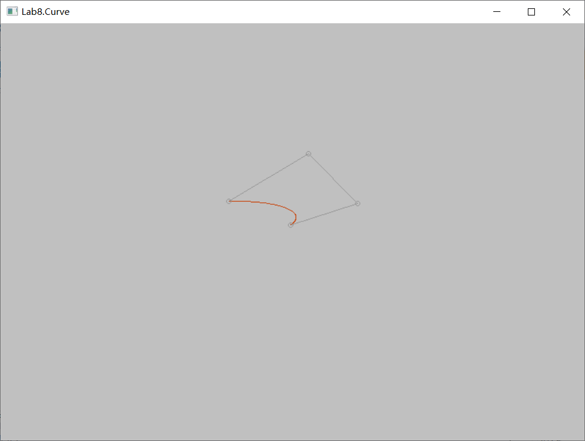
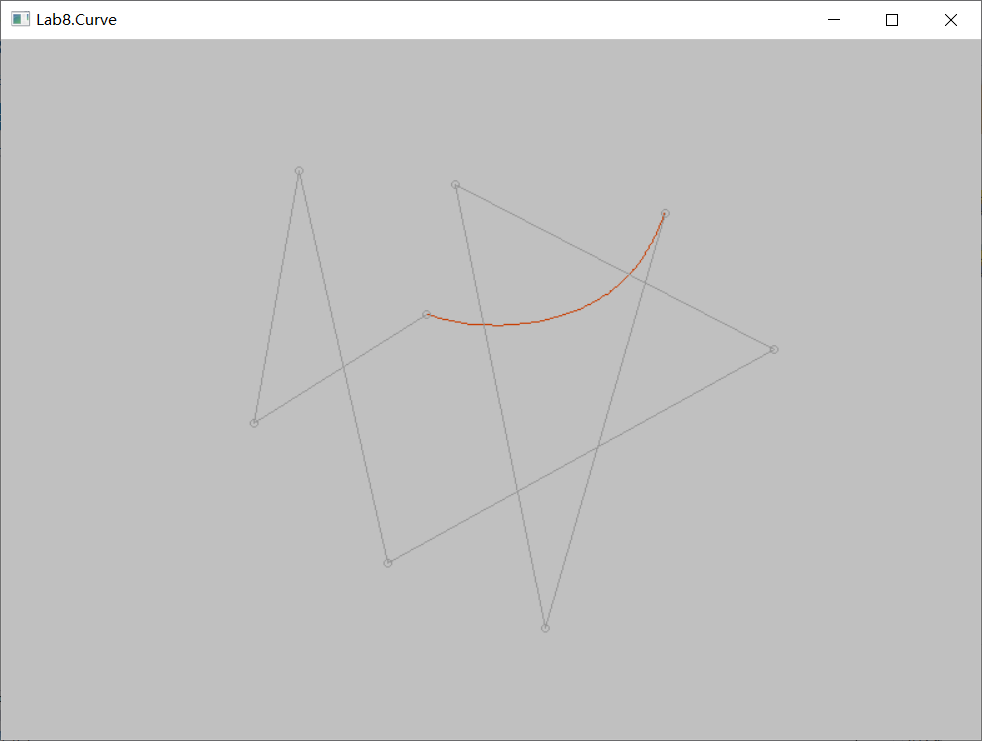
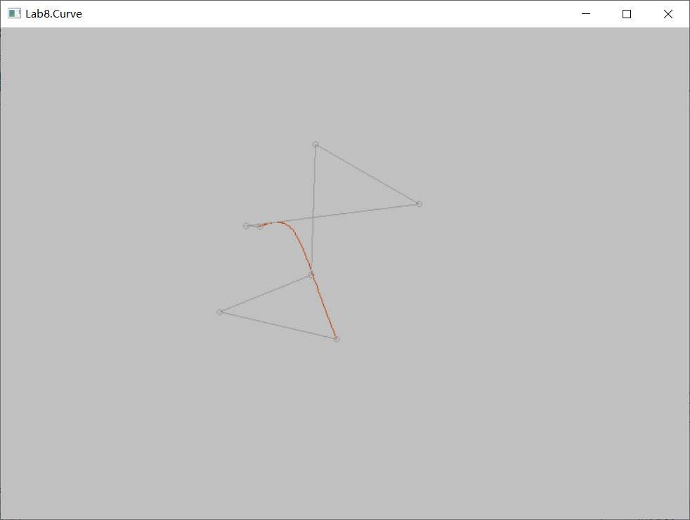

# 华东师范大学计算机科学与技术实验报告

| 实验课程：计算机图形学 | 年级：2018        | 实验成绩：            |
| ---------------------- | ----------------- | --------------------- |
| 实验名称：Bezier曲线   | 姓名：李泽浩      | 实验日期：2021/04/25  |
| 实验编号：8            | 学号：10185102142 | 实验时间：13:00-14:40 |
| 指导教师：李洋         | 组号：            |                       |

## 一、实验目的

•练习利用GDI绘制实现基本Bezier曲线。


## 二、实验环境

Visual studio 2019 + Windows 10


## 三、实验内容

##### •练习利用GDI绘制实现基本Bezier曲线。

•原理：


## 四、实验过程与分析

代码实现（非递归方法实现）：

```c++
void draw_bezier(const std::vector<Vector2> &control_points,
                 std::vector<std::pair<int, int>> &buffer) {
/*
	void draw_line(int src_x, int src_y, int dst_x, int dst_y,
	std::vector<std::pair<int, int>> &buffer)
*/
    // calculate the Bezier curve
    // and use draw_line to draw the curve
    
    int size = control_points.size();
    Vector2 control_init = control_points[0];
    Vector2 controls[100];
    
    for(double t=0; t<1; t+=0.01)
    {
        for(int j=0; j<size; j++)
        {
            for(int k=j; k< size; k++)
            {
                if(j == 0)
                    controls[k] = control_points[k];
                else
                {
                    controls[k].x() = t * control_points[k] + (1-t) * controls[k-1].x();
                    controls[k].y() = t * control_points[k] + (1-t) * controls[k-1].y();
                }
            }
        }
        draw_line(control_init.x(),control_init.y(),controls[size-1].x(),controls[size-1].y(),buffer);
        control_init = controls[size-1];
    }
}
```


## 五、实验过程总结

截图如下：








## 六、附录


