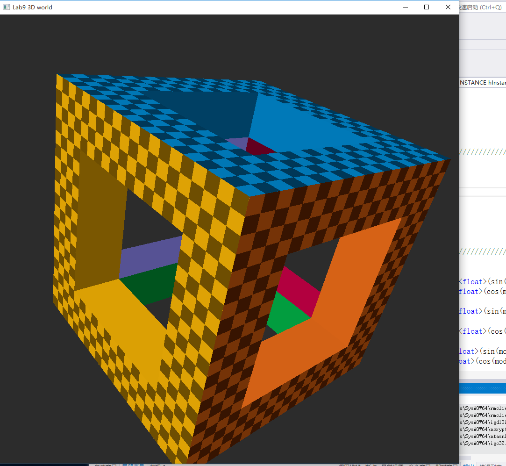
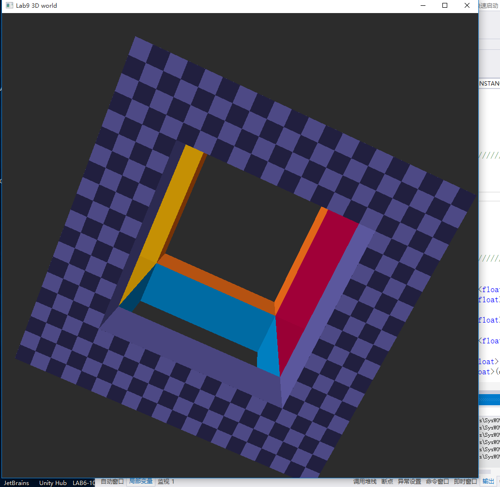
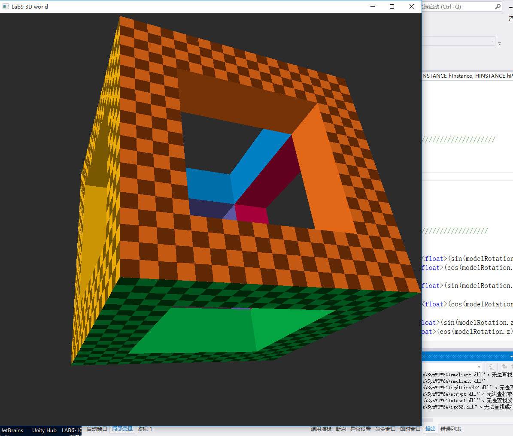

# 华东师范大学计算机科学与技术实验报告

| 实验课程：计算机图形学 | 年级：2018        | 实验成绩：            |
| ---------------------- | ----------------- | --------------------- |
| 实验名称：三位渲染     | 姓名：李泽浩      | 实验日期：2021/04/27  |
| 实验编号：9            | 学号：10185102142 | 实验时间：13:00-14:40 |
| 指导教师：李洋         | 组号：            |                       |

## 一、实验目的

•利用D3D API实现基本3D流水线。


## 二、实验环境

Visual studio 2019 + Windows 10 + D3D 11


## 三、实验内容

◦读懂代码

◦增加旋转功能


## 四、实验过程与分析

代码实现：

```c++
//在while(true)中增加如下代码即可，其中数字表示每次旋转改变的角度，数值越大旋转越快
	modelRotation.x += 0.1;
	modelRotation.y += 0.1;
	modelRotation.z += 0.1;
```


## 五、实验过程总结

截图如下

初试立方体截图：

如下


增加旋转代码后，随机截取几张运行截图：








## 六、附录


